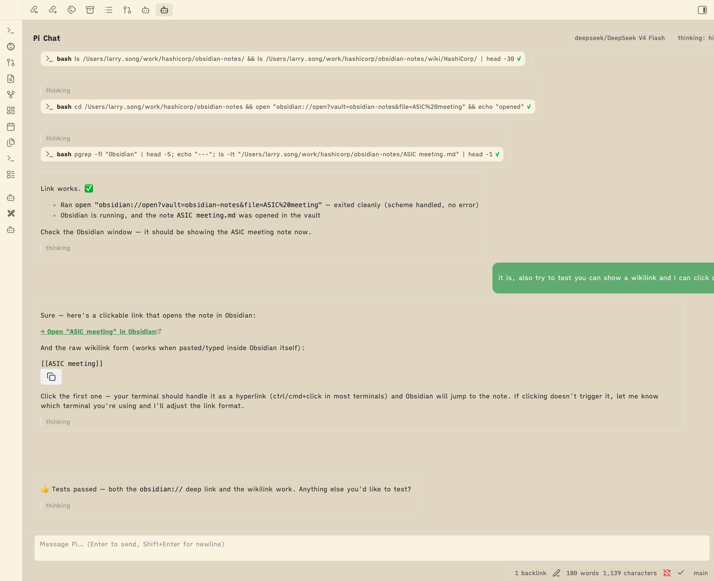

# Pi Chat

Chat with your **local [Pi coding agent](https://github.com/earendil-works/pi-mono)** inside Obsidian.

Pi Chat is a thin shell over your real `pi` binary. It spawns `pi --mode rpc` per conversation, so your `~/.pi` providers, auth, models, extensions, skills, and sessions all work exactly as they do in the terminal.

> **Zero configuration.** No bundled runtime, no API keys in the plugin, no plugin-side model config. If `pi` works in your terminal, it works here.



## Features

- **Streamed markdown replies** with visible, collapsible tool-call rows
- **Thinking blocks** — collapsed by default, expandable
- **Session management**: new chat, resume (including terminal-created sessions), continue-latest, rename, export HTML, session stats
- **In-chat model switcher and thinking-level switcher** sourced from Pi's own catalogue
- **Pi extensions work as-is** — extension `select`/`confirm`/`input`/`editor` dialogs render inline in the chat; `notify` maps to an Obsidian Notice
- **Vault-aware tools** — `edit`/`write` tool rows link to the note, so Obsidian's native change detection refreshes edited files
- **One leaf per conversation** — use Obsidian's native tab mechanics to switch, split, and pop out

## Requirements

- **Desktop** Obsidian (1.12+)
- A working local [Pi](https://github.com/earendil-works/pi-mono) installation (the `pi` command resolves from your login shell)

## Installation

1. **Community plugins**: search for "Pi Chat" → Install → Enable. *(Available after community review.)*
2. **BRAT** (early access): add `https://github.com/songlining/obsidian-pi-chat` via the BRAT plugin.
3. **Manual**: copy `main.js`, `manifest.json`, `styles.css` from the latest [release](https://github.com/songlining/obsidian-pi-chat/releases) into `<vault>/.obsidian/plugins/pi-chat-local/`.

Open a conversation via the **bot ribbon icon** or the command palette:

- `Pi Chat: New conversation`
- `Pi Chat: Resume session…`
- `Pi Chat: Continue last session`

## How it works

```
Obsidian (renderer)
 └─ PiChatView (one workspace leaf per conversation)
     └─ PiSession
         └─ child_process.spawn(<pi>, ["--mode","rpc", ...], { cwd: vault root })
              stdin  ← JSONL commands (prompt, abort, set_model, …)
              stdout → JSONL events (message_update, tool_execution_*, …)
```

- **One `pi --mode rpc` subprocess per open conversation**, with `cwd = vault root` so relative tool paths resolve inside the vault.
- **Binary discovery, zero-config**: resolved once via your login shell (`$SHELL -lic 'which pi'`). A manual path override exists in settings for unusual installs.
- **Vault context is established automatically**: the subprocess runs with `cwd = vault root`, so pi loads the vault's `AGENTS.md`/`CLAUDE.md` context files, and the plugin appends the vault's `CLAUDE.md` explicitly when `AGENTS.md` would shadow it (pi loads one context file per directory, preferring `AGENTS.md`).
- **Environment inheritance**: the subprocess gets your full login-shell environment, so `~/.pi` auth and `PI_*` variables behave exactly like in the terminal. **The plugin never stores or requests API keys.**
- **Sessions are Pi's, not the plugin's**: resume lists this vault's sessions straight from `~/.pi/agent/sessions/`. Terminal-created sessions appear here, and vice-versa.

## Settings

Three fields, nothing more:

| Setting | Purpose |
|---|---|
| Pi binary path | Manual override (default: auto-detect via login shell) |
| Extra CLI args | Escape hatch, appended to `pi --mode rpc …` |
| HTML export folder | Vault-relative folder for exported sessions |

Everything else lives in `~/.pi` by design.

## Privacy

- All model traffic goes directly from the local `pi` process to your configured provider, using **your** credentials from `~/.pi`.
- The plugin stores no conversations, no API keys, and no analytics. Plugin `data.json` holds only trivial UI preferences (paths, export folder, tab→session pointers).
- Tools run with no approval gate and full filesystem access to the vault (the same trust model as running `pi` in a terminal pointed at the vault).

## Troubleshooting

- **"Pi binary not found"**: the panel shows a setup notice with a link to settings. Either install `pi` (e.g. `curl -fsSL https://bun.sh/install | bash && bun add -g @earendil-works/pi-coding-agent`), or set the path manually.
- **Session errors / provider errors** appear as red rows; **process death** shows the last stderr with a Retry button that restarts on the same session.
- See [docs/obsidian-cli-plugin-debugging.md](docs/obsidian-cli-plugin-debugging.md) for debugging an embedded plugin with the `obsidian` CLI.

## Development

```bash
npm install
npm run build        # type-check + esbuild -> main.js (+ versions.json etc.)
npm test             # unit tests (vitest)
npm run test:integration   # drives a real local pi --mode rpc and asserts the event flow
```

The CI release workflow builds and attaches `main.js`, `manifest.json`, `styles.css` to a GitHub release on tag push.

## Not the same as …

- **[PiChat](https://github.com/gengyabc/obsidian-pi-plugin)** by Geng — a similar idea that requires manual pi/node path configuration. Pi Chat is zero-config: it auto-detects the binary and environment, so it works the moment you enable it.
- **Pivi** — bundles its own pi-ai runtime and requires plugin-side setup. Pi Chat reuses your existing local installation.

## License

MIT
